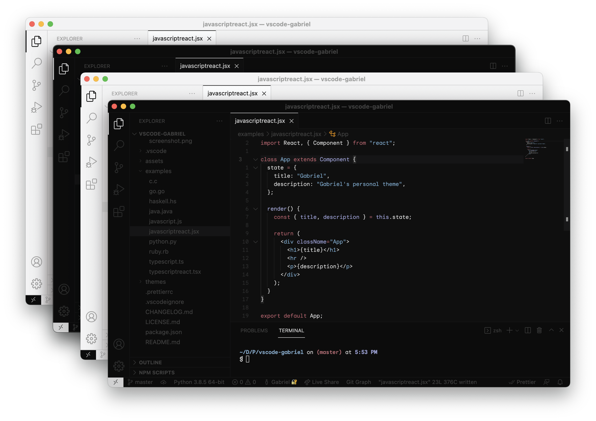
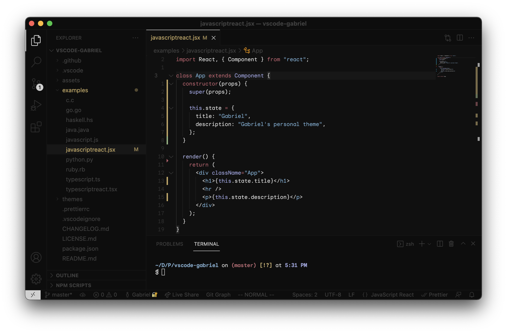
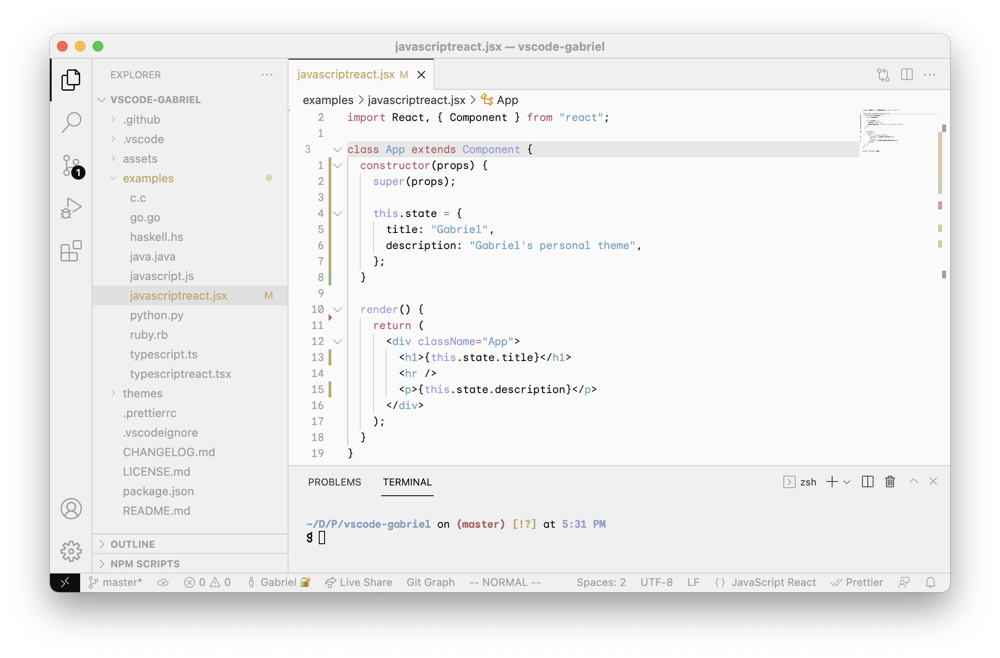

<center>
  
</center>

# VSCode Gabriel

   

Gabriel's (me) personal VSCode theme, a combination of dark & light themes fully made to be easy in the eyes, with soft tone transitions, the right amount of contrast, and most importantly, a 10/10 readability. This theme focuses highly on productivity & aesthetics, to code out in the light, or stay at your cave in the dark.

<center>
  
</center>

## Install

Installation is as simple as opening the command palette and typing:

```sh
ext install gabriel
```

Click the extension with the big 'g', then, go to `Preferences > Color Theme`, and select whatever variant you want it from the dropdown list, and voilà! You're ready to go.

## Variants

This theme is packed up as 4 different variants, 2 light ones, and 2 dark ones, each from which one will be normal text, and the other one will contain _italics_ (for those who love 'em).

### Gabriel (Dark)



### Gabriel (Dark Italic)


### Gabriel (Light)



### Gabriel (Light Italic)


## License

Licensed under the [MIT](https://opensource.org/licenses/MIT) license.
